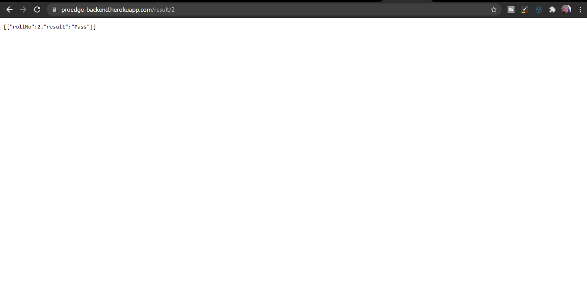
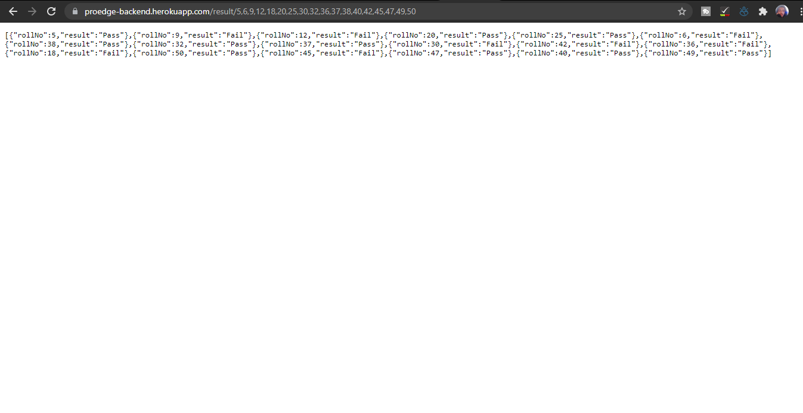

# Proedge Task

This repository is backend part of Proedge Task
Index.js file contains all the logic part of the project.
Array is used to store roll numbers which we get from frontend.
In the API an async function is created which is needed to make multiple API calls.
Promise.All function is used for making api calls
When response is received for all the roll numbers a JSON object is created which is then passed on to the front end.

## Libraries used

1. node-fetch
2. cors
3. express

# Screenshots

